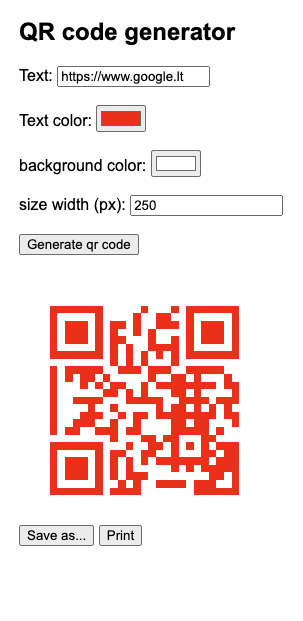

QR Code Generator
A simple and dynamic QR code generator built with Node.js and the qrcode library. This application provides a web interface to generate QR codes based on user input including text, color, background color, and size.

Features
Dynamic QR code generation from user input.
Real-time preview of the QR code as user changes settings.
Ability to download and print the generated QR code.
Customizable color, background color, and size of the QR code.
Installation & Setup
Ensure you have Node.js installed.

Clone the repository:

git clone https://github.com/RokasBakunas/qr-online.git

Navigate to the project directory and install the dependencies:

cd qr-code-generator
npm install

Start the server:

npm start

Visit http://localhost:3000 in your web browser to access the QR Code Generator.

[Usage]
Enter the desired text for the QR code.
Choose a color, background color, and size for the QR code.
Click on "Generate qr code" to view the QR code.
Use the "Save as..." button to download the QR code or the "Print" button to print it.
Contributing
Contributions, issues, and feature requests are welcome! Feel free to check the issues page.

License
This project is MIT licensed.

